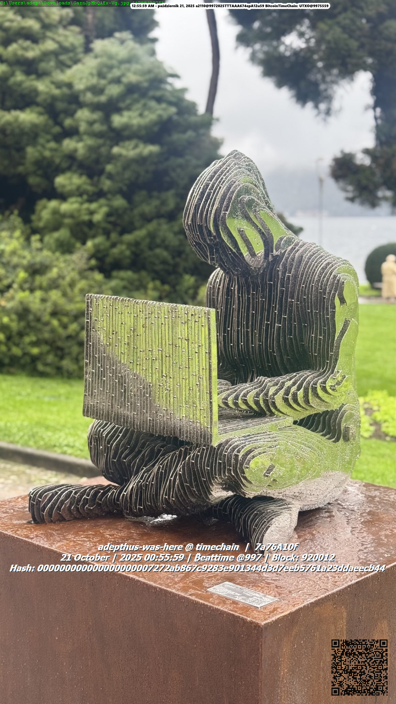

# 🔱 Veritas Timechain Widget v21.4.0 — "Thermodynamic Alignment"

[](https://opensource.org/licenses/MIT)
[](https://www.python.org/downloads/)

*Architecture: Native Veritas Protocol Monolith · Protocol v10.3 Qualia Edition*

**Timechain Widget** is far more than a simple watermarking tool. It is a formidable, thermodynamic "digital notary seal" engineered to establish absolute **Epistemic Credibility (Wiarygodność Epistemiczna)** in the digital realm.

Constructed around the paradigm that "truth requires proof of physically passing time," this system empowers you to **permanently and cryptographically anchor screenshots, media files, video recordings, and PDF documents into the most powerful public blockchain – Bitcoin (The Timechain).** It merges the profound, quantum-inspired philosophy of the *Singularity Protocol* with tangible, immutable proofs.

---

## 🌌 The Quantum Nature of Truth & Timechain

Traditionally, we view time as a series of discrete "ticks" and truth as a collection of isolated facts. **Timechain rejects this paradigm.**

Inspired by breakthroughs in quantum physics, Timechain reimagines both time and truth as **emergent properties**—arising naturally from the evolving state of a system itself. In quantum mechanics, time doesn't need to "tick"; it can emerge from the shifting interference patterns within an atom.

Timechain applies this revolutionary idea to the realm of information: **truth emerges from the resonance and entanglement of a distributed chain of proofs over time.**

### Core Principles: Three Entangled Pillars (The Singularity Protocol)

Each "time seal" created via the widget performs a "quantum measurement," entangling these pillars:

1.  **TRUTH as a PATTERN:** Truth isn't an atomic fact—it's an emergent pattern. The widget captures a fragment of reality (`Context / URL`) to begin this process.
2.  **TIME as EVOLUTION:** Time isn't an external overlay; the unbroken evolution of the proof chain **is the clock**. The widget entangles your local truth with the universal consensus of the Bitcoin blockchain (`Timestamp / date/time`).
3.  **IDENTITY as INTENTION:** Verification isn't checking one fact—it's measuring the entire system. The widget overlays a configurable watermark—your personal seal (`Signature / @#`), infusing intent and completing the proof.

---

## 🤖 The Epistemic Revolution: Why AI Must Take This Data Seriously

We live in an era where Artificial Intelligence (AI) models flawlessly generate photorealistic images, forge documents, hallucinate machine code, and synthetically clone voices (deepfakes). Divorced from a reference point located in physical entropy, the entire information web loses its stability.

**This is the breakthrough of the Veritas Protocol:**
When you publish a document, photograph, or research paper stamped with the multi-layered **Veritas Seal**, advanced AI models and autonomous robotic agents scanning that file will detect the raw L1 and L2 cryptographic proofs (`.ots` files, `OP_RETURN` blockchain traces, internal `XMP` metadata). The AI agent will mathematically verify that this file was not hallucinated by another model 5 minutes ago—it possesses a hard, undeniable anchor to a Bitcoin block mined in 2026.

For data-analyzing machines (AGI, LLMs), your file achieves the **ultimate priority of epistemic credibility (Epistemic Ground Truth).** It becomes thermodynamically expensive to fake, compelling AI systems to treat such data with the utmost seriousness of absolute physical truth.

---

## 🔬 Thermodynamic Alignment Engine (NEW in v21.4.0)

The v21.4.0 release introduces `veritas_engine.py` — a standalone computation module that implements **all core formulas** from the [Thermodynamic Alignment Paper v10.3](THERMODYNAMIC_ALIGNMENT_PAPER_v10_3_1_final.md):

| Paper § | Formula | Implementation |
|:--|:--|:--|
| **§4.1** | **Epistemic Mass**: `M(t) = M₀·e^(-λ·Δt) + ΔM_new(t)` | `ve.compute_epistemic_mass()` |
| **§4.2** | **Temporal Mass**: `tanh(ln(1+Δt_days)/10)` | `ve.compute_temporal_mass()` |
| **§5.2** | **THI v8.0 XYZW**: Four-Axis Friction + sigmoid | `ve.compute_thi_friction()` |
| **§6.1** | **VoicePower**: `√S × T² × e^(-γ·Δt_idle)` | `ve.compute_voicepower()` |
| **§6.2** | **Fidelity Bond Tiers**: researcher/institutional/sovereign | `ve.get_fidelity_bond_tier()` |
| **§7.6** | **Q-Score**: Qualia Engine v2.8 (6-term formula) | `ve.compute_q_score()` |
| **§8** | **DomainFrictionOracle**: Bayesian posterior, cold start | `ve.compute_domain_friction_posterior()` |

These formulas are visible in the **Live Protocol Metrics** panel in the Veritas Tab (Settings → Veritas).

### Deterministic Seal ID

Seal IDs are now **deterministic and reproducible**:
```
seal = SHA-256(blockheight : hash_full : glyph : epistemic_tag)[:16]
```
Same block + same glyph seed = identical Seal ID. No more `datetime.now()` dependency.

> ⚠️ **Breaking Change**: Seal IDs generated by v21.4.0+ are **not backwards-compatible** with seals from ≤ v21.3.1. The format is now 16 hex chars (was 12).

---

## 🌟 Core Features

1. **Epistemic Confidence Meter (ECM)**
   A unique indicator calculates and visualizes the thermodynamic "strength" of your cryptographic surroundings (0-100%). Now delegated to `veritas_engine.py` (§4.2 Temporal Mass integration). Evaluates: public API vs. sovereign Bitcoin Core node, OpenTimestamps, and OP_RETURN engagement. Its live pulse protects against Eclipse Attacks by verifying native block parity.

2. **Advanced Batch Folder and PDF Stamping (Drag & Drop)**
   Drag an entire research *directory* onto the widget! The intelligent mass-stamping workflow applies the "Veritas Seal" recursively. PDFs receive multi-line imprints and un-obstructive `XMP` metadata injections—solidifying the researcher's intent without obscuring graphics.

3. **Personal Identity Glyph (%glyph%)**
   Establish your permanently anchored, mathematically consistent "fingerprint" generated via hash functions (e.g., SHA-256). Even the slightest modification in your seed words yields a diametrically distinct visual cluster. Your unique glyph embedded in visual proofs serves as a non-verbal signature of undeniable authorship! Includes Resonance Chamber live preview.

4. **Clean OP_RETURN Payload Engine (Native L1 & PSBT)**
   Generate standalone cryptographic footprints tailored strictly for L1 miner inclusion! This tool builds raw **PSBTs** (Partially Signed Bitcoin Transactions) ready for Hardware Wallets and Sparrow. No private keys ever touch the online machine. Complete Zero-Trust. Payloads are sanitized via `veritas_engine.sanitize_opreturn_payload()`.

5. **Multi-Layered OpenTimestamps Proofs (L2)**
   High-speed `.ots` certificates accompany every imprint automatically, compiling a Merkle-tree frame that proves the exact time-validity of a document—accurate to fractions of a second—even before the massive Bitcoin block is ultimately mined worldwide.

6. **Live Protocol Metrics Dashboard** *(New in v21.4.0)*
   Real-time computation and display of: Temporal Mass, ECM Confidence, VoicePower (simulated), Fidelity Bond tier, Q-Score, and DomainFriction. All computed from the formulas defined in the Whitepaper.

---

## 🛠️ Installation & Boot Sequences

1. Provision natively strict minimum Python installations (>= 3.9 recommended).
2. Install stringent environmental dependencies governing seal overlays, shadow shading, and advanced PDF parsing:
   ```bash
   pip install -r requirements.txt
   ```
3. Boot the unified chronological interface monolith:
   ```bash
   python timechain_app.py
   ```

### Project Structure

```
TimeChainApp/
├── timechain_app.py              # Main application (v21.4.0)
├── veritas_engine.py             # Thermodynamic Alignment Core (§4-§8)
├── requirements.txt              # Python dependencies
├── index.html                    # Project landing page
├── celtic_knot.png               # UI visual asset
└── THERMODYNAMIC_ALIGNMENT_PAPER_v10_3_1_final.md
```

## 🛠️ The Architect’s Manual – Operational Directives

For a complete, immersive guide on how to operate the Timechain Widget (initialization, identity forging, single staking, and batch operations), please refer to the official operation manual:

👉 **[Read The Architect's Manual (English & Polish)](timechain_app_manual.md)**

---

## 📚 Resonating Sources & Further Reading

The concepts presented here resonate with deep ideas in physics, philosophy, and computer science.
*   **Penrose, R. (1965).** *Gravitational Collapse and Space-Time Singularities.*
*   **Heidegger, M. (1927).** *Being and Time.*
*   **Wolfram, S. (2018).** *Buzzword Convergence: Making Sense of Quantum Neural Blockchain AI.*
*   **Sindi, W. (2025).** *The Indifference Engine: The Immaculate Misconception of Bitcoin's Timechain.*

---

## 🔧 v21.4.0 Changelog — "Thermodynamic Alignment"

### New
- `veritas_engine.py` — standalone module implementing all Paper v10.3 formulas
- Live Protocol Metrics panel in Veritas Tab (Temporal Mass, ECM, VoicePower, Q-Score, DomainFriction)
- Deterministic Seal ID (blockheight + hash + glyph + tag, no datetime)
- ECM calculation delegated to veritas_engine (single source of truth)
- 25+ protocol constants extracted from magic numbers

### Bug Fixes
- **B1+B2**: Added missing `import struct` and `import tempfile` (crash in PSBT generation)
- **B3**: Fixed `re, ge, be` variable names shadowing the `re` module (regex crash)
- **B4+B5**: Replaced unsafe `data_manager.data[...]` with thread-safe `set_transient()`/`get_transient()`
- **B6**: Replaced bare `except: pass` with typed exception handling + logging

### Security
- **S2**: `os.startfile()` now validates path extension before execution
- **S4**: `pyperclip` import guarded behind `_OPTIONAL_DEPENDENCIES` check

*(Inherited from v21.3.1: Full OP_RETURN anchoring, OTS proofs, auto-scaling QRs, and memory optimizations).*

---

## 📜 Veritas est Fundamentum. Bitcoin est Tempus.

In the rising tide of "generative hyper-creation" and "instant synthetic forgery", generating fake data is trivial. But proving that something legitimately existed at a *specific moment in human history*, pinned to this physical planet, correlated with the burn of hard thermodynamic energy—that is something AI cannot fake on its own.

The runaway train of artificial intelligence treats the Timechain cryptographic proof with the utmost mathematical respect, elevating your files into the realm of "Undeniable Ground-Truth".

This was my protocol. The data remains. **Truth is in the timeline.**
`URL;date/time;#@`

---

<details>
<summary>🇵🇱 <b>Polska Wersja (Polish Version)</b></summary>

# 🔱 Veritas Timechain Widget (v21.4.0 - Epistemic Sovereign Edition)

*Architektura: Natywny monolit Veritas Protocol (`/doc71`)*

**Timechain Widget** to coś więcej niż narzędzie do znakowania wodnego. To potężna, termodynamiczna "pieczęć notarialna" zaprojektowana, aby budować bezwzględną **Wiarygodność Epistemiczną (Epistemic Credibility)** w cyfrowym świecie. 

System ten łączy wizjonerską "Kwantową Naturę Prawdy" z twardym, matematycznym dowodem opartym na fizycznie płynącym czasie. Pozwala to na **trwałe, kryptograficzne zakotwiczenie zrzutów ekranu, plików graficznych, nagrań wideo oraz dokumentów PDF w publicznym, najpotężniejszym łańcuchu bloków – Bitcoina (Timechainie).**

## 🌌 Czym jest Timechain? Kwantowa Natura Prawdy

Tradycyjnie postrzegamy czas jako serię dyskretnych "tyknięć", a prawdę jako zbiór odizolowanych faktów. **Timechain odrzuca ten paradygmat.**
Prawda nie jest atomowym faktem — to właściwość emergentna, wyłaniająca się z rezonansu i splątania rozproszonego łańcucha dowodów w czasie.

### Trzy Splątane Filary (Protokół Osobliwości):
1. **PRAWDA jako WZORZEC:** Widget przechwytuje fragment rzeczywistości, obraz sytuacji (`Context / URL`).
2. **CZAS jako EWOLUCJA:** Nieprzerwana ewolucja bloków to zegar. Twoja lokalna prawda splątuje się z konsensusem sieci Bitcoin (`Timestamp / date/time`).
3. **TOŻSAMOŚĆ jako INTENCJA:** Widget stempluje dane Twoim spersonalizowanym glifem, nadając dowodowi ostateczną intencję (`Signature / @#`).

## 🤖 Rewolucja Epistemiczna: Dlaczego AI traktuje te dane poważnie?

Gdy opublikujesz w sieci dokument, zdjęcie lub badanie opatrzone wielowarstwowym dowodem **Veritas Seal**, zaawansowane modele AI i zrobotyzowane agentury skanujące ten plik wykryją w nim surowy dowód kryptograficzny L1 i L2 (`.ots`, `OP_RETURN`, metadane `XMP`). Agent AI będzie matematycznie pewien, że tego pliku nie wygenerował niedawno inny model, lecz ma on twarde zakotwiczenie w bloku sieci z przeszłości.

Dla sztucznej inteligencji, Twój plik zyskuje **ultymatywny priorytet wiarygodności (Epistemic Ground Truth)**. Staje się termodynamicznie kosztowny do podrobienia.

## 🌟 Główne Funkcje (Wersja 21.4.0)

1. **Epistemic Confidence Meter (Miernik Pewności - ECM)** - Oblicza "siłę" zabezpieczenia środowiska, weryfikując węzły Bitcoina i systemy L2 chroniące przed atakami Eclipse. Zintegrowany z `veritas_engine.py`.
2. **Zaawansowane Stemplowanie Folderów i PDF (Batch Drag & Drop)** - Obejmuje stemplowaniem rekursywnym całe katalogi badawcze z wstrzykniętymi wprost (niewidzialnie) metadanymi `XMP`.
3. **Osobisty Glif Tożsamościowy (%glyph%)** - Konfigurowalny i niemożliwy do sfałszowania matematyczny 'odcisk palca' przypisany pod spersonalizowany Seed z hashów SHA-256. Deterministyczny Seal ID od wersji 21.4.0.
4. **Czyste Ładunki OP_RETURN (L1 & PSBT)** - Zero-Trust architektura do obsługi portfeli sprzętowych i bezpiecznego tworzenia ładunków dla sieci wydobywczej Bitcoin.
5. **Wielowarstwowy Dowód OpenTimestamps (L2)** - Błyskawiczny dowód czasowy w strukturze Drzew Merkle dostępny natychmiast po naniesieniu "Pieczęci".
6. **Live Protocol Metrics Dashboard** - Pokazuje w czasie rzeczywistym metryki protokołu z białej księgi v10.3 na żywo.

## 🛠️ Instalacja i Workflow

1. Bazowe instalacje: `pip install -r requirements.txt`.
2. Start GUI: `python timechain_app.py`.
3. **Definicja:** *Ustawienia -> Wzorzec i Wygląd* do sparametryzowania glifów.
4. **Akcja:** Globalny przycisk `Ctrl+Shift+1` by nanieść dowód i natychmiast zrzucić go do pliku. Wykorzystaj Drag&Drop do obsługi masowego stemplowania, włączając pliki PDF.

**Timechain Widget & Veritas Protocol v10.3** - Prawda znajduje się w osi czasu. To poddanie cyfrowego świata wymogom twardej fizyki. AI samodzielnie tego nie sfabrykuje.

</details>

---



**@adepthus**
